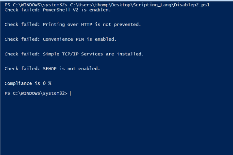
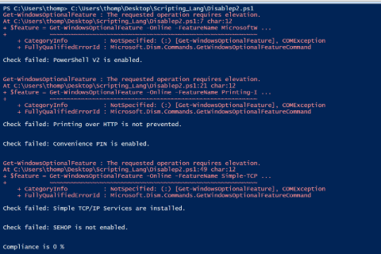

[Back to Portfolio](./)

Final Project - STIG Powershell Script
===============

-   **Class:** Survey of Scripting Languages - CSCI 301
-   **Grade:** 100/100
-   **Language(s):** Powershell
-   **Source Code Repository:** [features/mastering-markdown]([https://guides.github.com/features/mastering-markdown/](https://github.com/ladyTootie/CSCI-301-code-repository/blob/master/FinalProject/STIG_Compliance.ps1))  
    (Please [email me](mailto:trthompson@student.csuniv.edu?subject=GitHub%20Access) to request access.)

## Project description

For my final project in Surver of Scripting Languages, I chose to check for compliance on a Windows OS using STIG. Since my major is Cybersecurity, I figured this would be good practice. I used Windows PowerShell ISE to write my script, and I checked for five of the STIG compliances on a Windows machine. The compliances I checked for were PowerShell v2 disablement, printing over HTTP is is diabled, convenience PIN is disabled, simple TCP/IP Services are not installed, and if SEHOP is enabled. The scripts fetches each features status and outputs a pass or fail message depending on the status. Once all features are checked, the program gives a compliance percentage telling the user how compliant the machine is with the selected features. This script must be run in administrator mode in PowerShell ISE to properly check for compliance.

## How to run the program

Download the ".ps1" file from the GitHub repository link. Then open Windows PowerShell ISE in administator mode, then open the file in the ISE and press the "run" button. 

## UI Design

Almost every program requires user interaction, even command-line programs. Include in this section the tasks the user can complete and what the program does. You don't need to include how it works here; that information may go in the project description or in an additional section, depending on its significance.

When the program is ran in administrator mode, it'll proceed with all feature checks without any error messages (see Fig 1). If the program is not ran in administrator mode, the check for PowerShell v2, printing over HTTP, and TCP/IP compliance will throw an error message because the program needs to have elevated privelage to check those features (see Fig 2).

  
Fig 1. Example output when script is ran in administrator mode.

  
Fig 2. Example output when script is not ran in administrator mode.

## 3. Additional Considerations

Sed ut perspiciatis unde omnis iste natus error sit voluptatem accusantium doloremque laudantium, totam rem aperiam, eaque ipsa quae ab illo inventore veritatis et quasi architecto beatae vitae dicta sunt explicabo. 

For more details see [GitHub Flavored Markdown](https://guides.github.com/features/mastering-markdown/).

[Back to Portfolio](./)
