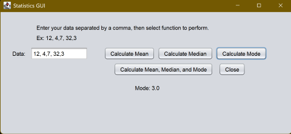
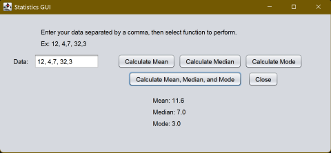

[Back to Portfolio](./)

Statistics GUI Calculator
===============

-   **Class:** Object Oriented Programming - CSCI 325
-   **Grade:** N/A
-   **Language(s):** Java
-   **Source Code Repository:** <a href="https://github.com/ladyTootie/Statistics-GUI-Calculator" onclick="window.open('https://github.com/ladyTootie/Statistics-GUI-Calculator', '_self');">
  Statistics GUI Calculator </a>
  
    (Please [email me](mailto:trthompson@student.csuniv.edu?subject=GitHub%20Access) to request access.)

## Project description

This program is a Statistics calculator. It is a GUI program in Java created using Netbeans. This program can take any comma seperated values (CSV), and calculate the mean, median, mode of said numbers. It can calculate and produce output for those calculations individually or simultaneously. Upon the user providing input, the program "cleans" the data by removing spaces and commas to begin calculations, and stores the parsed numbers in an array to retrive them and perform calculations on them.

## How to compile and run the program

In the terminal navigate to the folder where the program resides, then run this command to compile the program:

**javac StatisticsGUI.java**

Then this command to run it:

**java StatisticsGUI**

## UI Design

The user can type their desired CSVs into the text field, and press the buttons to get the mean, median, mode, or all three. The user can continuously press buttons to get the next desired output without having to input their CSV again. The user can also change their CSV and get new calculations. When the user is finished, the can press the "close" button to exit the program. In total there are five buttons.

  
Fig 1. Mean Calculation.

  
Fig 2. Mode Calculation.

Fig 3. Mean, median, and mode calculations.

For more details see [GitHub Flavored Markdown](https://guides.github.com/features/mastering-markdown/).

[Back to Portfolio](./)
