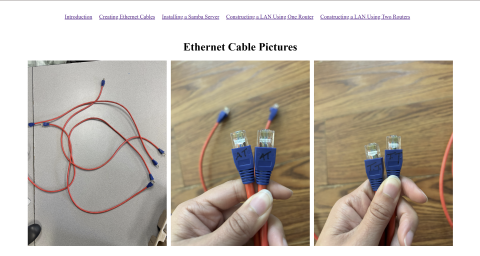
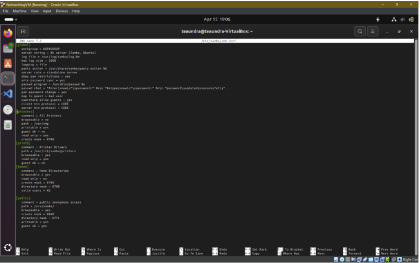
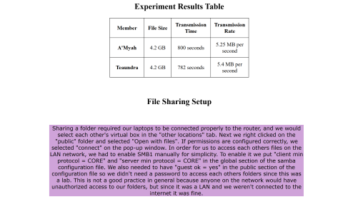

[Back to Portfolio](./)

LAN Lab Website
===============

-   **Class:** Applied Networking - CSCI 332
-   **Grade:** 100/100
-   **Language(s):** HTML
-   **Source Code Repository:** <a href="https://github.com/ladyTootie/LAN-Lab/tree/main" onclick="window.open('https://github.com/ladyTootie/LAN-Lab/tree/main', '_self');">
  LAN Lab </a>
  
    (Please [email me](mailto:trthompson@student.csuniv.edu?subject=GitHub%20Access) to request access.)

## Project description

This project was a rather interesting lab I completed with a partner in Applied Networking. While it is not exactly a "program" it involved  rigourous work, and it displays my knowledge of networking which is critical for a cybersecurity professional. I worked with A'Myah Temple to complete this project. We had to construct a LAN using our laptops, a router, and ethernet cables. We had to create the ethernet cables, and verify they were functional. Then we had to configure the router, install and configure Samba servers on our VMs to create a public folder to shar files. We connected both of our laptops to the router via the ethernet cables, and we were able to browse through each other shared folders and transfer them to each other's machines. There was an additional part to the lab, constructing a LAN using two routers. We were not able to complete that part due to the fact we did not have any identical routers. Different routers would not allow communication between their clients due to firewall rules.

## How to access the html website

Navigate to the provided repository and download the "Lab_5/Networking" folder. Then on your machine navaigate to the folder, and open the "index.html" file. Depending on your default browser, your computer will either open the website in Edge or Chrome.

## UI Design

At the top of the website, there are hyperlinks to see pictures from the different parts of the project. The link "Constructing a LAN Using One Router" leads to a page where the user has to scroll down to see extra content. 

  
Fig 1. Image of the ethernet cables we created.

  
Fig 2. Image of the status of my Samba server.

Fig 3. Image of a table of the file transfer rates on the LAN, and the setup process of the Samba servers.

For more details see [GitHub Flavored Markdown](https://guides.github.com/features/mastering-markdown/).

[Back to Portfolio](./)
