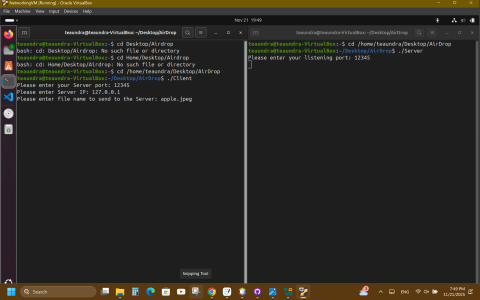
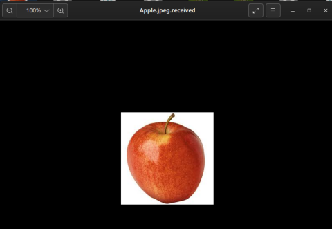

[Back to Portfolio](./)

UDP Client and Server
===============

-   **Class:** Applied Networking - CSCI 332
-   **Grade:** 100/100
-   **Language(s):** c++
-   **Source Code Repository:** <a href="https://github.com/ladyTootie/UDP-Client-and-Server" onclick="window.open('https://github.com/ladyTootie/UDP-Client-and-Server', '_self');">
  UDP Client and Server </a>
  
    (Please [email me](mailto:trthompson@student.csuniv.edu?subject=GitHub%20Access) to request access.)

## Project description

This project is a UDP client and server that implements a handshake. It was written in c++ using Visual Studio Code and it was created on a Linux VM. This program can be run locally by specifying the localhost IP "127.0.0.1". If not running locally, you need to acquire the server's IP. These programs can reliably transfer small files in a low traffic network. The clietn and server prompts the user for a listening port, which can be any number, but it has to be the same for bothe the client and the server. After that, the client prompts the user for the IP adress, and then the file name to be transferred. The server waits for a "Data" packet to be sent from the client to begin reading in the file data. The client send the file data in bytes, and when each byte is received the server sends an acknowledgment to the client. If the client does not receive an acknowledgement then it keep sending the byte until it does. When the client is finished transmitting file date, it sends a "Done" packet and closes the file and socket. When the server receives the "Done" packet it sends an acknowledgment writes the received data to a file with the extension ".received". Then the server closes the file and the socket.

## How to compile and run the programs

For compatibility, compile and run the programs on a Linux machine.
Navigate to the respective directory and excecute the following commands in seperate terminal windows to compile:

**g++ Client.cpp -o Client** and **g++ Server.cpp -o Server**

Then execute these commands to run the programs:

**./Client** and **./Server**

## UI Design

The user will be prompted by both the client and server to provide a listening port (See Fig 1). Then the client will ask for an IP address and a file name to transfer said file. The client and server will display acknowledgements confirming the files bytes were received.

  
Fig 1. Client and server prompting for input.

  
Fig 2. File transmitted from client to server.

Fig 3. Received file with new extension.

For more details see [GitHub Flavored Markdown](https://guides.github.com/features/mastering-markdown/).

[Back to Portfolio](./)
