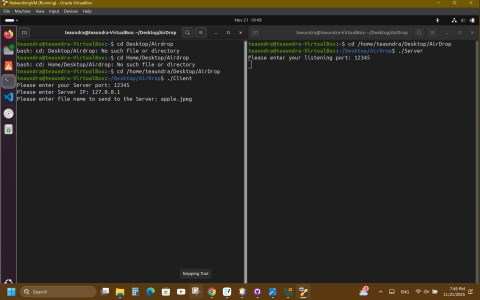
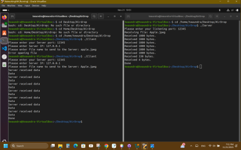
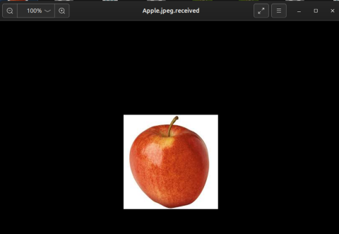

[Back to Portfolio](./)

ACE Senior Project
===============

-   **Class:** Applied Networking - CSCI 332
-   **Grade:** 100/100
-   **Language(s):** c++
-   **Source Code Repository:** <a href="https://github.com/ladyTootie/UDP-Client-and-Server" onclick="window.open('https://github.com/ladyTootie/UDP-Client-and-Server', '_self');">
  UDP Client and Server </a>
  
    (Please [email me](mailto:trthompson@student.csuniv.edu?subject=GitHub%20Access) to request access.)

## Project description

## How to compile and run the programs

## UI Design

The user will be prompted by both the client and server to provide a listening port (See Fig 1). Then the client will ask for an IP address and a file name to transfer said file. The client and server will display acknowledgements confirming the files bytes were received.

  
Fig 1. Client and server prompting for input.

  
Fig 2. File transmitted from client to server.

Fig 3. Received file with new extension.

For more details see [GitHub Flavored Markdown](https://guides.github.com/features/mastering-markdown/).

[Back to Portfolio](./)
